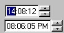



## TimeControl

### Description

Simple time control I made to satisfy my needs in one of my softwares. Might as well publish the source so that everyone can enjoy it...

Similar to DTpicker time control but it has some changes and other stuff...

Just add the User Control to your project and it's ready to use... no OCX's needed.

Feel free to modify etc, but respect my copyrights :p
 
### More Info
 

             |
---                |---
**Submitted On**   |2003-02-05 16:26:02
**By**             |[Jonne Lehtinen](https://github.com/Planet-Source-Code/PSCIndex/blob/master/ByAuthor/jonne-lehtinen.md)
**Level**          |Intermediate
**User Rating**    |4.8 (24 globes from 5 users)
**Compatibility**  |VB 6\.0
**Category**       |[Custom Controls/ Forms/  Menus](https://github.com/Planet-Source-Code/PSCIndex/blob/master/ByCategory/custom-controls-forms-menus__1-4.md)
**World**          |[Visual Basic](https://github.com/Planet-Source-Code/PSCIndex/blob/master/ByWorld/visual-basic.md)
**Archive File**   |[TimeContro153995252003\.zip](https://github.com/Planet-Source-Code/jonne-lehtinen-timecontrol__1-42982/archive/master.zip)

